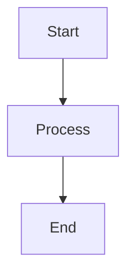

# hugo-Myblog Memo

この README は、このブログで記事を書くときに見返す用のメモです。  
Hugo や PaperMod の一般説明ではなく、このリポジトリで実際に使う書き方だけをまとめています。

## 起動と投稿

### ローカル起動

- `.\run.ps1`
  - 通常のローカル起動
- `.\runDraft.ps1`
  - 下書き記事も含めて確認したいとき
- `.\runIgnoreCache.ps1`
  - キャッシュの影響を避けて表示確認したいとき

補足:

- これらのスクリプトはローカル確認用に `http://localhost:1313/` を使う
- 本番の `baseURL` は `hugo.toml` に残してあるので、デプロイ設定はそのままでよい
- スクリプトを書き換えたあとに反映されない場合は、いったん起動中の Hugo サーバーを止めてから再実行する

### 新しい記事を作る

- `.\post.ps1 -name "my-post-name"`
- `.\post.ps1 -name "my-post-name" -type "tech"`

例:

```powershell
.\post.ps1 -name "float-notes"
.\post.ps1 -name "ff14-memo" -type "game"
```

これで `content/posts/float-notes.md` が作られる。

`-type` で使えるテンプレート:

- `default`
  - いちばん素のテンプレート
- `tech`
  - 技術記事向け。TOC を出しやすい
- `game`
  - ネトゲ記事向け。準備や手順を書きやすい
- `memo`
  - 短めのメモ向け

## 記事 Front Matter

よく使う項目:

```toml
+++
title = "記事タイトル"
date = 2026-04-04T12:00:00+09:00
draft = false
description = "一覧や OGP に使いたい短い説明"
categories = ["Programming"]
tags = ["Hugo", "メモ"]
series = ["コンピューターで計算する"]
showtoc = true
tocopen = true
math = false
+++
```

補足:

- `draft = true` にすると通常ビルドでは出ない
- `showtoc = true` で目次表示
- `tocopen = true` で目次カード自体を最初から開く
- `math = true` で KaTeX / Mermaid 関連の読み込みが有効になる
- `description` は一覧・検索・OGP で効く
- `series` を付けると関連記事や一覧でまとまりを出しやすい

### 記事タイプ別の使い分け

- `default`
  - いちばん素の状態から書きたいとき
- `tech`
  - 技術解説、数式、コード、比較、手順が入りやすい記事向け
- `game`
  - ネトゲ攻略、設定メモ、マクロ記事向け
- `memo`
  - 短めのメモや雑記向け

書き始めの目安:

- 技術記事なら `description`, `series`, `showtoc`, `math` を先に決める
- ゲーム記事なら `showtoc = true` と `update_note`, `steps`, `faq` が相性よい
- メモ記事なら `showtoc = false` のまま短くまとめると収まりやすい

## シリーズ / カテゴリの説明メモ

シリーズ一覧やカテゴリ一覧の説明文は `data/taxonomy_notes.toml` で管理している。  
個別のシリーズやカテゴリの紹介を足したいときは、同じ形式で追記すればよい。

```toml
[series."シリーズ名"]
description = "このシリーズで何を扱うか"

[categories."カテゴリ名"]
description = "このカテゴリにどんな記事が入るか"
```

補足:

- `overview` は一覧ページ全体の説明
- 同名の `series` / `categories` があると一覧カードにも説明が出る
- `series` を追加したら、記事の `series = ["..."]` と名前を揃える

## Callout

このブログでは Hugo の alert blockquote を使って callout を出せる。

使える種類:

- `note`
- `tip`
- `important`
- `warning`
- `caution`

### 通常の callout

```md
> [!NOTE] 補足
> この部分は note として表示される。
```

```md
> [!TIP] コツ
> ちょっとしたコツや補足を書く。
```

### 折りたたみできる callout

`[!TYPE]+` で最初から開く、`[!TYPE]-` で最初は閉じる。

```md
> [!IMPORTANT]+ 先に読んでおく
> 最初から開いた状態で表示される。
```

```md
> [!WARNING]- 注意
> クリックするまで閉じた状態にしておける。
```

## Quick Summary / 記事末尾まとめ

自動生成は使っていない。  
必要な記事だけ shortcode で手動挿入する。

### Quick Summary

```md

- この記事でわかること
- 先に知っておくと楽なこと
- 読みどころ

```

`title` を省略すると `Quick Summary` になる。

### 記事末尾のまとめ

```md

- 基本概念を整理した
- 実例を確認した
- 実装例を載せた

```

## 折りたたみブロック

長くなりすぎる補足は `collapse` shortcode を使える。

```md

ここに長めの補足を書く。

```

## マーカー風の下線

色付きマーカーで下線を引くような強調は `marker` shortcode を使う。

```md
ここをやわらかく強調
```

色を変える場合:

```md
桜っぽい強調
黄色マーカー
ミント系
青系
ラベンダー系
```

使える色:

- `pink`
- `sakura`
- `yellow`
- `mint`
- `blue`
- `lavender`

## ステップ表示

手順をカード風に並べたいときは `steps` shortcode を使う。

```md

1. 最初にここを確認する
2. 次に設定を変える
3. 最後に結果を見る

```

## インラインバッジ

短い補足ラベルは `badge` shortcode を使う。

```md
おすすめ
初心者向け
補足
```

## 比較ボックス

左右比較したいときは `compare` shortcode を使う。  
左右の本文は `<!--split-->` で区切る。

```md

- 直感的
- 導入しやすい
<!--split-->
- 細かい調整は苦手
- 慣れが必要

```

## 区切りラベル

章内で小さな区切りを入れたいときは `section_label` を使う。

```md
ここから実装
補足
```

## FAQ

よくある質問を折りたたみで置きたいときは `faq` を使う。

```md

使えます。まずは基本形だけ試すのがおすすめです。

```

最初から開く場合:

```md

ここに注意点を書く。

```

## 更新メモ

記事途中や記事末尾に更新履歴を置くなら `update_note` を使う。

```md

- 手順を最新化
- 説明を少し追記

```

## 参照リンクカード

関連記事や外部リンクは `linkcard` で見やすくできる。

```md

```

外部リンクでも同じように使える。

## 用語カード

短い用語説明は `term_card` を使う。

```md

Damage Per Second の略。火力役の総称として使うこともある。

```

## 数式

Front Matter で `math = true` を付ける。

インライン:

```md
$a^2 + b^2 = c^2$
```

ディスプレイ数式:

```md
$$
\int_0^1 x^2 dx = \frac{1}{3}
$$
```

```md
\[
f(x) = x^2 + 1
\]
```

## Mermaid

`math = true` を付けたうえで、コードフェンスに `mermaid` を指定する。

~~~md

~~~

Mermaid は専用カード風の見た目になる。

## コードブロック

普通の fenced code block を使えばよい。

~~~md
```python
print("hello")
```
~~~

補足:

- 言語ラベルは自動で付く
- 長いコードは自動で折りたたみ対象になることがある
- コピーボタンも付く

## 画像

### Markdown 画像

通常の Markdown 画像でよい。

```md

```

画像はライトボックス対応。  
キャプションを強めたい場合は figure shortcode も使える。

### Figure shortcode

```md

```

### 2枚比較

2枚比較:

```md

```

### ギャラリー

ギャラリー:

```md

  
  

```

### 横並び2枚＋全体キャプション

横並び2枚＋全体キャプション:

```md

```

### 縦長画像

縦長画像をすっきり置く:

```md

```

補足:

- 通常の Markdown 画像は lazy load と軽いサイズヒント付き
- `gallery_item` や `compare_images` も lazy load 済み
- `image_row` は2枚を1組で見せたいときに便利
- `portrait_image` は縦長画像が大きくなりすぎるのを防ぎやすい
- 画像が多い記事でも、本文の流れを止めにくいようにしてある

## 表

通常の Markdown table でよい。  
狭い表は中央寄せ、広い表は必要に応じて横スクロールまたは折り返しで表示されるよう調整済み。

## 記事を書くときのおすすめ

- 長い記事は最初に `summary` を置く
- 注意書きは callout を使う
- 補足が長いなら `collapse` を使う
- 数式や Mermaid を使う記事は `math = true`
- 章立てを分かりやすくすると TOC が活きる
- コードが多い記事は h2 / h3 を素直に切ると読みやすい

### 実戦サンプル

- `content/posts/sample-tech-article.md`
  - 技術記事向けの実戦寄りサンプル
- `content/posts/sample-game-article.md`
  - ゲーム記事向けの実戦寄りサンプル
- `content/posts/shortcode-showcase.md`
  - shortcode の見た目確認用ドラフト

いずれも `draft = true` なので `.\runDraft.ps1` で確認する。

確認URLの例:

- `http://localhost:1313/posts/sample-tech-article/`
- `http://localhost:1313/posts/sample-game-article/`
- `http://localhost:1313/posts/shortcode-showcase/`

新規作成時の目安:

- 技術記事を書くなら `.\post.ps1 -name "my-tech-note" -type "tech"`
- ゲーム記事を書くなら `.\post.ps1 -name "my-game-note" -type "game"`
- 最初はサンプル記事を見ながら、不要な装飾を削っていくほうが早い

## よくある確認ポイント

- ローカルなのに本番URLへ飛ぶ
  - 起動中の古い Hugo サーバーを止めてから `run.ps1` / `runDraft.ps1` を再実行する
- TOC を出したい
  - `showtoc = true`
- 数式が表示されない
  - `math = true` を付ける
- 下書きが見えない
  - `.\runDraft.ps1` を使う

## 関連ファイル

- `hugo.toml`
  - サイト全体の設定
- `post.ps1`
  - 新規記事作成
- `run.ps1`
  - 通常起動
- `runDraft.ps1`
  - Draft込みで起動
- `runIgnoreCache.ps1`
  - キャッシュ無視で起動
- `layouts/shortcodes/summary.html`
  - Quick Summary 用
- `layouts/shortcodes/article_points.html`
  - 記事末尾まとめ用
- `layouts/shortcodes/collapse.html`
  - 折りたたみ用
