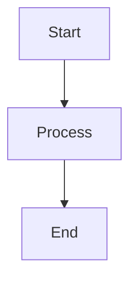

# hugo-Myblog Memo

この README は、このブログで記事を書くときに見返す用のメモです。  
Hugo や PaperMod の一般説明ではなく、このリポジトリで実際に使う書き方だけをまとめています。

## 起動と投稿

### ローカル起動

- `.\run.ps1`
  - 通常のローカル起動
- `.\runDraft.ps1`
  - 下書き記事も含めて確認したいとき
- `.\runIgnoreCache.ps1`
  - キャッシュの影響を避けて表示確認したいとき

補足:

- これらのスクリプトはローカル確認用に `http://localhost:1313/` を使う
- 本番の `baseURL` は `hugo.toml` に残してあるので、デプロイ設定はそのままでよい
- スクリプトを書き換えたあとに反映されない場合は、いったん起動中の Hugo サーバーを止めてから再実行する

### 新しい記事を作る

- `.\post.ps1 -name "my-post-name"`

例:

```powershell
.\post.ps1 -name "float-notes"
```

これで `content/posts/float-notes.md` が作られる。

## 記事 Front Matter

よく使う項目:

```toml
+++
title = "記事タイトル"
date = 2026-04-04T12:00:00+09:00
draft = false
categories = ["Programming"]
tags = ["Hugo", "メモ"]
showtoc = true
tocopen = true
math = false
+++
```

補足:

- `draft = true` にすると通常ビルドでは出ない
- `showtoc = true` で目次表示
- `tocopen = true` で目次カード自体を最初から開く
- `math = true` で KaTeX / Mermaid 関連の読み込みが有効になる

## Callout

このブログでは Hugo の alert blockquote を使って callout を出せる。

使える種類:

- `note`
- `tip`
- `important`
- `warning`
- `caution`

### 通常の callout

```md
> [!NOTE] 補足
> この部分は note として表示される。
```

```md
> [!TIP] コツ
> ちょっとしたコツや補足を書く。
```

### 折りたたみできる callout

`[!TYPE]+` で最初から開く、`[!TYPE]-` で最初は閉じる。

```md
> [!IMPORTANT]+ 先に読んでおく
> 最初から開いた状態で表示される。
```

```md
> [!WARNING]- 注意
> クリックするまで閉じた状態にしておける。
```

## Quick Summary / 記事末尾まとめ

自動生成は使っていない。  
必要な記事だけ shortcode で手動挿入する。

### Quick Summary

```md

- この記事でわかること
- 先に知っておくと楽なこと
- 読みどころ

```

`title` を省略すると `Quick Summary` になる。

### 記事末尾のまとめ

```md

- 基本概念を整理した
- 実例を確認した
- 実装例を載せた

```

## 折りたたみブロック

長くなりすぎる補足は `collapse` shortcode を使える。

```md

ここに長めの補足を書く。

```

## 数式

Front Matter で `math = true` を付ける。

インライン:

```md
$a^2 + b^2 = c^2$
```

ディスプレイ数式:

```md
$$
\int_0^1 x^2 dx = \frac{1}{3}
$$
```

```md
\[
f(x) = x^2 + 1
\]
```

## Mermaid

`math = true` を付けたうえで、コードフェンスに `mermaid` を指定する。

```md

```

Mermaid は専用カード風の見た目になる。

## コードブロック

普通の fenced code block を使えばよい。

```md
```python
print("hello")
```
```

補足:

- 言語ラベルは自動で付く
- 長いコードは自動で折りたたみ対象になることがある
- コピーボタンも付く

## 画像

通常の Markdown 画像でよい。

```md

```

画像はライトボックス対応。  
キャプションを強めたい場合は figure shortcode も使える。

```md

```

## 表

通常の Markdown table でよい。  
狭い表は中央寄せ、広い表は必要に応じて横スクロールまたは折り返しで表示されるよう調整済み。

## 記事を書くときのおすすめ

- 長い記事は最初に `summary` を置く
- 注意書きは callout を使う
- 補足が長いなら `collapse` を使う
- 数式や Mermaid を使う記事は `math = true`
- 章立てを分かりやすくすると TOC が活きる
- コードが多い記事は h2 / h3 を素直に切ると読みやすい

## よくある確認ポイント

- ローカルなのに本番URLへ飛ぶ
  - 起動中の古い Hugo サーバーを止めてから `run.ps1` / `runDraft.ps1` を再実行する
- TOC を出したい
  - `showtoc = true`
- 数式が表示されない
  - `math = true` を付ける
- 下書きが見えない
  - `.\runDraft.ps1` を使う

## 関連ファイル

- `hugo.toml`
  - サイト全体の設定
- `post.ps1`
  - 新規記事作成
- `run.ps1`
  - 通常起動
- `runDraft.ps1`
  - Draft込みで起動
- `runIgnoreCache.ps1`
  - キャッシュ無視で起動
- `layouts/shortcodes/summary.html`
  - Quick Summary 用
- `layouts/shortcodes/article_points.html`
  - 記事末尾まとめ用
- `layouts/shortcodes/collapse.html`
  - 折りたたみ用
