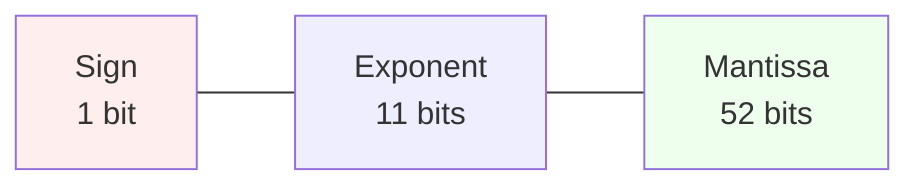

+++
title = '浮動小数点数'
date = 2025-12-07T19:03:04+09:00
draft = false
categories = ["Programming"]
tags = ["Float", "IEEE754", "数値計算", "誤差", "プログラミング"]
showtoc = true
tocopen = true
math = true
+++

---

> 💡 **この記事は「コンピューターで計算する」シリーズの一部です。**  
> [**1. 浮動小数点数**](../float)**👈 今ここ**  
> [**2. 区間演算**](../interval)  
> [**3. 数値積分**](../numericalIntegration)  

---

プログラミング中に **「0.1 + 0.2 が 0.3 にならない」** といった、浮動小数点数特有の挙動に戸惑った経験はないでしょうか。  
これは、コンピューターが数を扱うときに広く使われている浮動小数点数が実数をそのまま正確に扱えないことに起因しています。  
  
本題に入る前に、もうひとつ直感に反する例を見てみましょう。

## (x - a) + a = x ?

数学的には、次の等式は常に成り立ちます。

$$
\begin{aligned}
(x - a) + a = x
\end{aligned}
$$

ところが、これをコンピューターで計算すると、この等式が**成り立たない場合**があります。  
以下の Python プログラムを実行すると、その様子を実際に確認できます。  
（ C など他の言語でも再現できますが、最適化により挙動が変わる場合があります。）  

```python
import math

def calc_a(x):
    n = math.log2(abs(x))
    return 2 ** (n + 53)

for x in range(1, 21):
    a = calc_a(x)
    # x - a
    temp = x - a
    # (x - a) + a
    result = temp + a
    # (x - a) + a の結果を表示
    print(f"({x:2d} - a) + a = {result:5.1f}",end="")
    # result != x なら  Not Equal! を表示
    print("\n" if result == x else "   Not Equal!\n", end="")
```

実行結果：

```bash
> py calc.py
( 1 - a) + a =   1.0
( 2 - a) + a =   2.0
( 3 - a) + a =   4.0   Not Equal!
( 4 - a) + a =   4.0
( 5 - a) + a =   8.0   Not Equal!
( 6 - a) + a =   8.0   Not Equal!
( 7 - a) + a =   8.0   Not Equal!
( 8 - a) + a =   8.0
( 9 - a) + a =  16.0   Not Equal!
(10 - a) + a =  16.0   Not Equal!
(11 - a) + a =  16.0   Not Equal!
(12 - a) + a =  16.0   Not Equal!
(13 - a) + a =  16.0   Not Equal!
(14 - a) + a =  16.0   Not Equal!
(15 - a) + a =  16.0   Not Equal!
(16 - a) + a =  16.0
(17 - a) + a =  32.0   Not Equal!
(18 - a) + a =  32.0   Not Equal!
(19 - a) + a =  32.0   Not Equal!
(20 - a) + a =  32.0   Not Equal!
```

多くのケースで$(x - a) + a \neq x$となっています。  

---

### 情報落ち

**演算は正確に行われているが、変数 $x$ の情報が消えてしまう**  
この現象は、**倍精度浮動小数点数が保持できる精度に限界があるため**に起こります。
  
$(x - a)$の引き算を行う瞬間、**有限の桁**に**巨大な数$a$とそれに対して小さな数$x$を同時に収めよう**としています。  
しかし、**枠の桁数が足りず、$x$の情報は欠落**してしまいます。  

ここで重要なのは、これは

- 「計算がバグっている」
- 「演算途中でおかしな丸めが起きた」

といった種類の問題ではない、ということです。

演算そのものは IEEE 754 の規定どおり**正しく**行われています。  
ただし、倍精度浮動小数点数の **有効桁数は 53 ビットしかない** ため、

- 巨大な数 $a$
- それに比べて十分小さい数 $x$

$(x - a)$ の引き算を行う瞬間、**有限の桁数しかない器の中に、巨大な数 $a$ と、それに比べて十分小さい数 $x$ の両方を同時に収めよう** としています。

このように、

- 演算は仕様どおりに正しく行われている
- しかし「表現できる桁数が足りないせいで小さい項の情報が消える」

という現象を、ここでは **情報落ち** と呼んでいます。

### 桁落ち

似た現象として **桁落ち** があります。

- **情報落ち**  
  巨大な数 $\pm$ 小さな数  
  → 大きな数と小さな数の両方を同じ枠（有効桁数）に収めることができず、  
  小さいほうの項の情報が失われてしまう現象。

- **桁落ち**  
  左辺 $a$ と右辺 $b$ がほぼ等しい（$a \approx b$）とき、  
  $a - b$ の引き算をすると**有効桁数が極端に少なくなってしまう**現象。

桁落ちの場合は

$$
\begin{aligned}
(a - b) \times c
\end{aligned}
$$

のように後続の計算で誤差が大きく増幅されることがあります。  
特に、変数$c$が巨大な値だったとき、誤差が大きく増幅します。  

### 情報落ち・桁落ちの対策

情報落ちや桁落ちは **「演算そのもののミス」ではなく、演算を行う前の数値表現（ビットの限界）によって問題が生じる現象**です。  
しかし、**数学的に等価な別の計算方法**を選ぶことで回避できる場合があります。  

- **情報落ちの対策**  
    **計算順序を工夫する。**  
    情報落ちが起きやすいパターンとして、(「大きな値」+「中くらいの値」) + 「小さな値」のような計算順序になっていることがあります。  
    「小さな値」＋「大きな値」という計算を避けるために、（「小さな値」＋「中くらいの値」）＋「大きな値」の順で計算することで、小さな値の情報が失われにくくなります。  
    特に、加算をたくさん繰り返す処理では「これまでの合計」＋「次の項」という形になりがちで、**「大きな値」＋「小さな値」の状態を作りやすいため注意が必要です。**
- **桁落ちの対策**  
    **数式を変形する。**  
    **ほぼ等しい値同士の引き算**によって有効桁数が失われることが問題なので、差を直接計算することを避けるために式変形を行うことで対策することが可能です。

---

この記事ではこのような現象の正体を理解するために

- **コンピューターが実数を正確に扱えない理由**  
- **IEEE754 に基づく浮動小数点数の仕組み**  
- **どのような数が誤差なく表現できるのか**  
- **decimal 型や固定小数点数ではどうなるのか**  
- **精度を保証する計算方法の一例としての「区間演算」**

について順に解説していきます。

## 計算機（コンピューター）の数値表現

### 全ての実数を正確に表現することはできない

数学における実数は、数直線上に存在するすべての数を指し、無限に長い桁を持つものや、極端に大きい値・小さい値も含まれています。  
しかし、コンピューターが演算や記憶に使える桁数には限りがあり、表現できる値の大きさにも制約があります。  

多くのプログラミング言語やアプリケーションでは、数値を表現する方法として IEEE 754 規格の **2 進数の倍精度浮動小数点数（double precision）** が採用されています。  

数学の世界では無限のリソースを仮定できますが、現実のコンピューターが使えるリソースは有限です。倍精度浮動小数点数は、実数を **正確に表す値ではなく、あくまで近似的に表すための値** として使用されます。

## IEEE 標準規格の浮動小数点数

IEEE 754 標準規格で定められている浮動小数点数（正規化数）は、次のように表されます。

$$
\begin{aligned}
a &= (-1)^{s} \times \left( 1 + \frac{d_{1}}{2^{1}} + \frac{d_{2}}{2^{2}} + \dots + \frac{d_{N-1}}{2^{N-1}} \right) \times 2^{e} \\\\
s &\in \{0,1\},\quad s\ \text{is a bit} \\\\
d_{i} &\in \{0,1\},\quad d_{i}\ \text{is a bit}
\end{aligned}
$$

### 符号部（Sign bit）

浮動小数点数で **正負の符号を表す 1 ビット分の領域** を **符号部** と呼びます。  
符号 $s$ が $0$ なら正（$+$）、$1$ なら負（$-$）を表します。

$$
(-1)^{s}
$$

---

### 仮数部（Mantissa / Significand）

浮動小数点数で **有効桁（精度）を担う部分** を **仮数部** と呼びます。  
仮数部は単精度では 23 ビット、倍精度では 52 ビットです。  

IEEE 754 では、正規化数については先頭ビットが必ず $1$ になることを利用して、その $1$ を格納しない **ケチ表現（hidden bit）** を用います。  
このため、正規化数であれば単精度は 24 ビット分、倍精度は 53 ビット分の精度を持ちます。

$$
\begin{aligned}
m &= \left( 1 + \frac{d_{1}}{2^{1}} + \frac{d_{2}}{2^{2}} + \dots + \frac{d_{N-1}}{2^{N-1}} \right) \\\\
d_{i} &\in \{0,1\},\quad d_{i}\ \text{is a bit}
\end{aligned}
$$

十進数で見ると、単精度は約 7 桁程度、倍精度はおよそ 15～16 桁程度の精度があります。

$$
\begin{aligned}
24\log_{10}(2) &\approx 7.22 \\\\
53\log_{10}(2) &\approx 15.95
\end{aligned}
$$

---

### 指数部（Exponent）

小数点の位置（2 進数での桁のシフト量）や数の大きさを表す部分を **指数部** と呼びます。  
指数部は一定のバイアス値を加えることで、負の数を含む指数を符号なし整数で表現する **バイアス付き整数** として格納されます。

$$
2^{e}
$$

指数部のビット列を $E$ としてバイアス値を $b$ とすると、実際の指数 $e$ は

$$
e = E - b
$$

で表されます。  
  
単精度および倍精度の指数部のビット数やバイアス値は次のようになります。

| 精度 | 指数部 | $E$ | $b$ | $e = E - b$ |
|:----:|:------------:|:-------------------:|:--------------:|:-----------------------------:|
| **単精度 (32bit)** | **8bit** | $1 \le E \le 254$ | $b=127$ | $-126 \le e \le 127$ |
| **倍精度 (64bit)** | **11bit** | $1 \le E \le 2046$ | $b=1023$ | $-1022 \le e \le 1023$ |

---

### 特別な指数ビット列

また、特別な指数ビット列は次の用途に予約されています。

| 指数部 | 仮数部 | 値の種類 | 説明 |
|------------------|------------|----------|------|
| $E = 0$ | $m = 0$ | $\pm 0$ | 正負のゼロ |
| $E = 0$ | $m \neq 0$ | 非正規化数 | 絶対値が極端に小さい、0に非常に近い数を表す方法 |
| $E_{max}$ | $m = 0$ | $\pm \infty$ | 計算結果が表現可能な範囲を超えたときなどに現れる。この現象を **オーバーフロー** と呼ぶ |
| $E_{max}$ | $m \neq 0$ | NaN（非数） | 0 で割るなど、数として解釈できない結果を表す |

- **指数部$E=0$は指数ビット列がすべて0のときを指します。**  
- **指数部$E_{max}$は指数ビット列がすべて1のときを指します。**  
    単精度：$E = 255$  
    倍精度：$E = 2047$

---

### 精度による違い

浮動小数点数の精度には単精度（32 ビット）、倍精度（64 ビット）、任意精度など様々なものがあります。  
精度が高くなると仮数部のビット数が増えることで **扱える桁数（有効桁数）** が増え、指数部のビット数が増えることで **表現できる値の範囲** も広くなります。  

正規化数に対する仮数ビット $N$ と指数 $e$ の範囲は次のようになります。

$$
\begin{aligned}
\text{単精度}\quad N &= 24,\quad  -126 \le e \le 127 \\\\
\text{倍精度}\quad N &= 53,\quad  -1022 \le e \le 1023
\end{aligned}
$$

図にすると次のような感じになります。

- **単精度(32bit)**


- **倍精度(64bit)**



---

### なぜすべての実数を正確に表現できないのか

浮動小数点数を用いてすべての実数を正確に表現できない理由は、次の 3 点にまとめられます。

- **2 進数で小数を表現していること**  
    10 進数では有限桁で書ける数でも、2 進数にすると無限に続く小数になる場合が多くあります。  
    有名な例として**循環小数**になる **0.1** が挙げられます。

- **有効桁数（仮数部のビット数）が有限であること**  
    2 進小数が無限に続く場合でも、途中でどこかの桁で丸める必要があります。  
    この過程で**丸め誤差（rounding error）** が発生します。

- **扱える指数の範囲が有限であること**  
    指数部のビット数には限りがあるため、極端に大きい値・小さい値は表現できません。

---

### 浮動小数点数で正確に表現可能な例

仮数部の構造に注目すると、**浮動小数点数で正確に表せる値は、実は非常に限られている**ことがわかります。  
次の数のうち、倍精度浮動小数点数で **誤差なく正確に表現できる数** はどれでしょうか？

$$
\begin{aligned}
0.1,\ 0.2,\ 0.3,\ 0.4,\ 0.5,\ 0.6,\ 0.7,\ 0.8,\ 0.9
\end{aligned}
$$

答えは **0.5 のみ** です。

$$
\begin{aligned}
0.5 = \frac{1}{2^1}
\end{aligned}
$$

理由は次の通りです。

浮動小数点数で正確に表現できる実数は、

$$
\begin{aligned}
&\frac{\mu}{2^\nu}\\\\
\mu, \nu &\in \mathbb{Z}
\end{aligned}
$$

の形で書けて、かつ **指数が指数部の範囲内に収まる必要があります**。  
  
つまり、次の **3 つすべてを満たす場合にのみ** 正確に表現できます。

- **2 進表現が有限で終わること（$2^{\nu}$ で割った形に書けること）**  
- **分子$\mu$が仮数部のビット数で表せる範囲の整数であること**  
- **浮動小数点数の形に直した時に、指数が指数部の範囲内に収まること**

この条件を満たすのは、上の例では **0.5（1/2）** のみです。  
  
他にも、次のような値は2進小数が有限で終わり、仮数部と指数部の範囲に収まるため正確に表現できます。

$$
\begin{aligned}
\qquad \qquad 3.625 &= 2^1 + 2^0 + \frac{1}{2^1} + \frac{1}{2^3} \\\\
      &= \frac{29}{2^3}
\end{aligned}
$$

$$
\begin{aligned}
0.75  &= \frac{1}{2^1} + \frac{1}{2^2} \\\\
      &= \frac{3}{2^2}
\end{aligned}
$$

$$
\begin{aligned}
0.000000954606549 &= \frac{1}{2^{20}} + \frac{1}{2^{30}} + \frac{1}{2^{40}} + \frac{1}{2^{50}}\\\\
      &= \frac{1,074,791,425}{2^{50}}
\end{aligned}
$$

## 10進数の浮動小数点数なら誤差は発生しない？

10 進数の浮動小数点数（decimal 型）は、2 進数の倍精度浮動小数点数（double 型）と比べて「10 進で有限桁の小数を正確に表せる」という利点があります。  
たとえば **0.1** や **0.01** などは decimal 型では誤差なく表現できます。

しかし、次の問題は依然として残ります。

- **有効桁数（仮数部の桁数）が有限であること**  
- **扱える指数の範囲が有限であること**

そのため decimal 型でも、例えば

$$
\frac{1}{3} = 0.333333\dots
$$

のように **10 進でも無限に続く小数**を厳密に保持することはできません。

また、decimal 型は double 型に比べて **指数部の範囲が狭い**ため、  
表現できる値の最大値・最小値が小さくなり、  
「非常に大きな数値」「非常に小さな数値」を扱う用途には向きません。

つまり、decimal 型は

- **10進基準の計算を正確に行いたい**
- **ただし扱える数値レンジは狭くなる**

という特徴を持った形式です。

## 固定小数点数は？

固定小数点数（fixed-point）も、decimal 型と同様に **有効桁数が有限である** という問題を避けることはできません。  
そのため、表現できる値は刻み幅に依存しており、次の制約が存在します。

- **表せる小数の刻みが固定されている（例：0.01 刻みなど）**
- **その刻みで表せない値は丸めが発生する**
- **扱える範囲も有限である（オーバーフローの可能性）**

たとえば小数第2位までしか保持しない固定小数点形式では、

$$
0.123 \rightarrow 0.12
$$

のように必ず丸めが発生します。

固定小数点数は、演算が高速で予測可能という利点がある一方で、  
浮動小数点数のように **広い範囲の数を柔軟に扱うことはできません**。

## それでも厳密に正しい値を保持したい

浮動小数点数では誤差を完全に避けることはできませんが  
**計算結果が必ず真の値を含む範囲（区間）として得られる方法** があります。  
その一つが **区間演算（Interval Arithmetic）** です。

区間演算を用いることで、丸め誤差を含む計算でも、「真の値が必ずこの範囲にある」という **精度保証付きの計算(Verified numerics)** が可能になります。

## まとめ

- **コンピューターは有限のビット数しか持たないため、実数をそのまま格納することはできない**  
- **IEEE 754 浮動小数点数は「近似計算のための仕組み」であり、誤差は避けられない**  
- **正確に表せる値はごく限られた「2進で有限に表せる数」のみ**  
- **decimal 型や固定小数点数にも、精度や範囲の制限がある**  
- **「誤差を含んだまま安全に計算したい」という目的には区間演算が有効**

次の記事では、区間演算ライブラリを紹介します。
